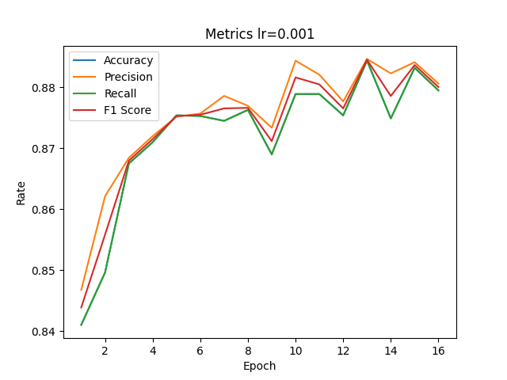

# [2_RNN.py](./2_RNN.py)

训练效果可视化

## 记录

用RNN做图像分类总有种不太对劲的感觉，因为不知道RNN所要的`序列`该怎么取。
看了Github上这个数据集里的图片，一开始设想按行/列为时间单位顺序输入是一种方法，但结果训练出的正确率不如像素一个一个来。虽然结果上正确率也没有上90%。

总之，RNN跟基础神经网络的区别就是可以处理有某种顺序的序列数据，吃一口，消化一下，再吃再消化，而不是等吃完才能消化。
