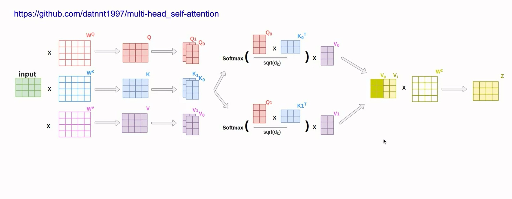
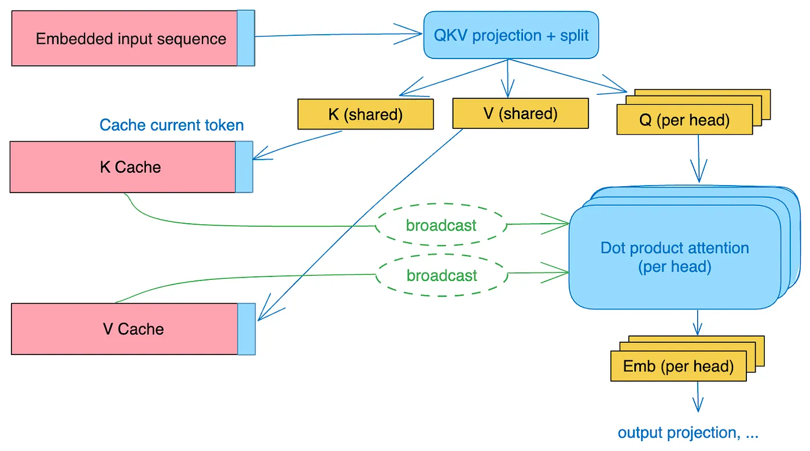
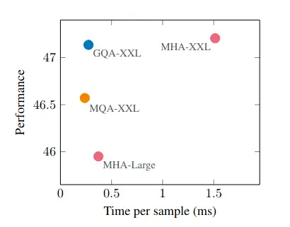

## 1. 注意力机制
### 实现步骤：

**1. 线性投影：** 将查询、键和值矩阵分别线性变换投影到多个不同的子空间。

**2. 缩放点积：** 计算Q和K的点积，然后除以缩放因子。有助于稳定梯度并防止注意力权重变得太大。

**3. Softmax：** 对缩放后的点积应用 softmax 函数，得到注意力权重。

**4. 加权求和：** 将注意力权重与V相乘，得到加权和。

## 2. 多头注意力机制
### [MHA代码](./3_MHA.py)

个人理解，多头注意力是在经典注意力机制的基础上，让其注意更多特征，比如说，在一段音频中如果要识别某个音节，不仅可以注意音调，还可以注意音色、音高等等方面，即所谓多方评估，使得模型更精确。

在写代码的过程中，比较挑战的点是使得多头的计算同时进行。

令我困惑的是QKVO的W矩阵是怎么得来的，但是时间不够了，所以先放着。

## 3. Multi Query Attention

### [MQA代码](./3_MQA_GQA.py)
> 多查询注意力（Multi-Query Attention）是一种注意力机制，它允许模型同时关注输入序列中的多个查询。与传统的注意力机制（例如自注意力）不同，多查询注意力可以并行处理多个查询，从而提高效率和建模能力。

一言蔽之，可参考条件越多，定位越精确。

比如说
> 
> **问答**： 同时关注问题和上下文中的多个单词，以提取更相关的答案。
> 
> **文本摘要**： 同时关注文档中的多个句子，以生成更简洁、更全面的摘要。

所以，多查询本质上是在单查询的组合。在单查询注意力中，模型一次只能关注一个查询。这可能会限制模型从数据中提取信息的范围。相比之下，多查询注意力允许模型同时考虑多个查询，从而获得更全面的理解。且具有以下优势：

> **并行处理**: 允许模型同时关注多个查询，从而提高效率。\
> **信息融合**: 允许模型从多个来源融合信息，提高准确性。

### MQA实现

符号表达：
**Attention(Q, K, V) = [softmax(q_1.T K), softmax(q_2.T K), ..., softmax(q_m.T K)] * V**

其中：

Q 是一个 m x d 查询矩阵，其中 m 是查询的数量，d 是查询的维度。

K 是一个 n x d 键矩阵，其中 n 是键值对的数量，d 是键的维度。

V 是一个 n x v 值矩阵，其中 v 是值的维度。

softmax(q_i.T K) 计算每个查询 q_i 与所有键 k_j 之间的注意力权重。这是一个 m x n 矩阵。
[softmax(q_1.T K), softmax(q_2.T K), ..., softmax(q_m.T K)] 是一个 m x n 矩阵，包含所有查询和键之间的注意力权重。

## 3. Group Query Attention

### [GQA代码](./3_MQA_GQA.py#L21)
GQA乍一看跟MQA差不多，查资料后发现GQA实际上是Google提出的MQA变种，主要为了解决计算成本和效率问题。MQA为每个查询创建一个单独的注意力权重,GQA为每个组创建一个注意力权重。
> GQA是MHA和MQA的折衷方案，既不想损失性能太多，又想获得MQA带来的推理加速好处。具体思想是，不是所有 Q 头共享一组 KV，而是分组一定头数 Q 共享一组 KV。

网上看到的一个选择MQA或GQA的经验法则：

1. 如果查询数量较少（<100），则MQA通常是更好的选择，因为它更准确且更易于解释。

1. 如果查询数量较大（>100），则GQA通常是更好的选择，因为它更具可扩展性和存储效率。

1. 如果需要为每个查询定制注意力机制，则MQA是唯一的选择。

1. 如果可解释性很重要，则MQA是更好的选择。

