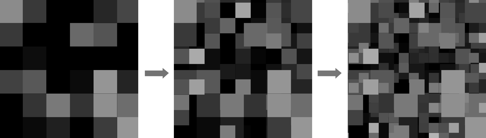

# 记录

## Day 5
### 1. T1-2 
&emsp;&emsp;终于，今天把《动手学深度学习(PyTorch版)》中与本次算法题相关的部分简单过了一遍。第一题有点不明所以，一会查一下资料。先看全连接这题吧，感觉还是比较基础的。

[1_2_fc_mnist.py](./1_2_fc_mnist.py)

首先从线性神经网络说起，以一元线性回归模型为例：

$$\begin{cases}y=ax+b+\epsilon \\ \epsilon \sim N(0,\sigma^2)\end{cases}$$

&emsp;&emsp;可以通过线性回归建立从特征到标签的线性模型。但是，特征与标签间往往不是简单的线性关系。因此，我们引入激活函数，如sigmoid，tanh，以及relu等，使多个线性关系叠加，就如同泰勒展开、傅里叶分解一般，能够将复杂的关系用最基本的关系去逼近。

&emsp;&emsp;多层感知机大概干的便是这么一件事：后面的层对前面所有层进行分型叠加。那么中间的层就可以视为元数据中蕴含的某种模式Pattern。类似噪波叠加octave。如果叠加层数太少，那么便显得单调空洞，但若叠加层数太多，又会显得杂乱。

&emsp;&emsp;因此，中间隐藏层的增加很有必要，且层数也很关键。

